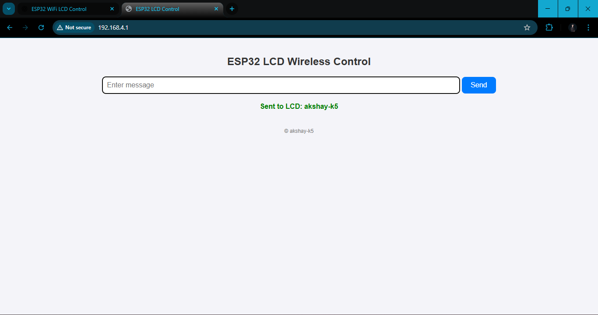
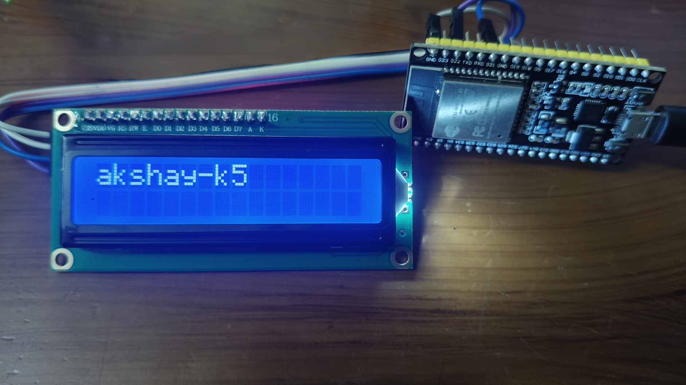

# ESP32 LCD Wireless Text Display

This project demonstrates how to use an **ESP32** with an **I2C LCD** to display Wi-Fi credentials, IP address, and user-sent messages via a web interface.  
If the message is longer than 16 characters, it will scroll smoothly on the display.  
The project also supports **real-time interruption** of scrolling when a new message is received.

---

## 📷 Project Preview

### Screenshot of Web UI

### Hardware Setup

---

## 🚀 Features
- Wi-Fi credentials and IP scroll endlessly on boot  
- Messages longer than 16 characters scroll smoothly  
- New messages interrupt current scroll immediately  
- Simple Web UI to send text to ESP32 over Wi-Fi  
- LCD with I2C interface for compact wiring  

---

## 🔧 Hardware Required
- ESP32 Dev Board  
- 16x2 I2C LCD Display  
- Jumper Wires  
- Breadboard / PCB  

---

## 🔌 Circuit Diagram
See `CIRCUIT_DIAGRAM.png` for complete wiring.

---

## 🌐 How to Use
1. Flash the ESP32 with the provided `ESP_WIFI_DISPLAY.ino`.  
2. Connect to the ESP32 Wi-Fi network (or your configured Wi-Fi).  
3. Open the  IP address shown in LCD in browser.  
4. Enter text in the webpage → It displays on LCD with smooth scrolling.  

